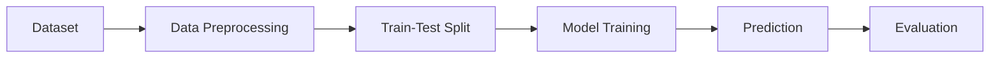
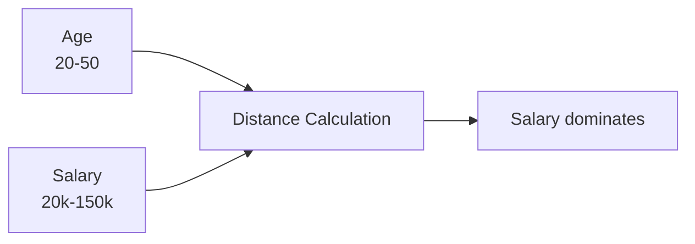
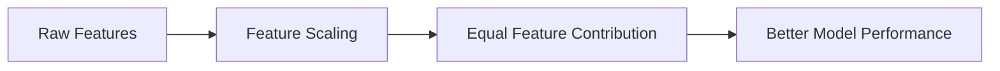
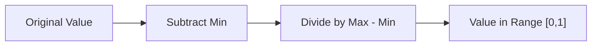
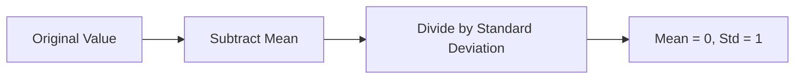
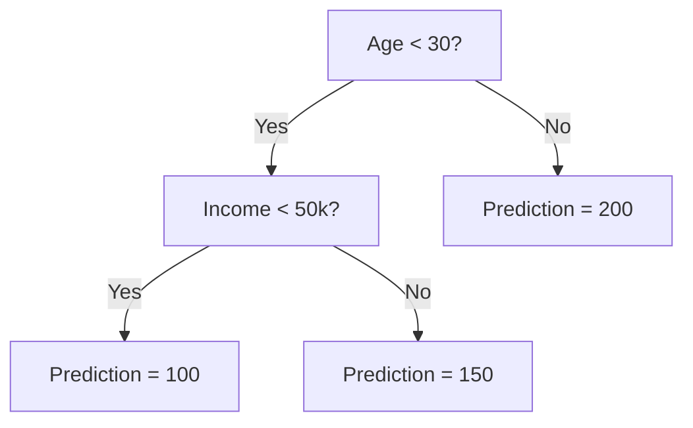
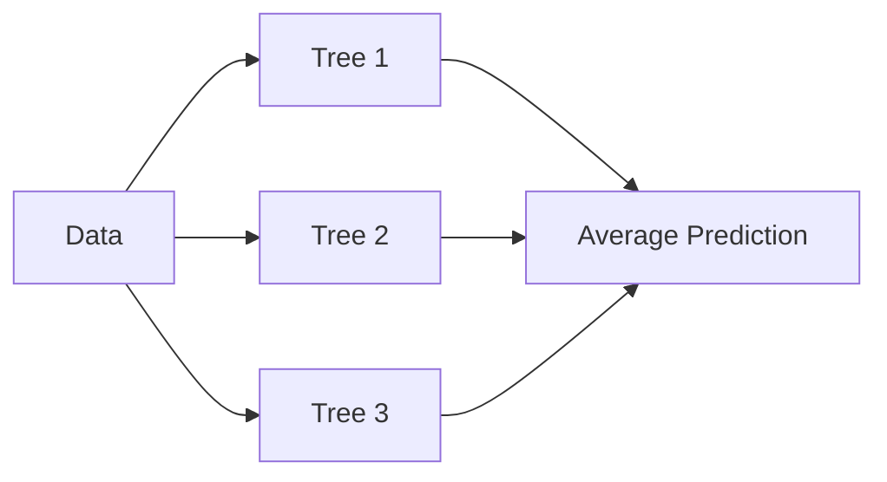
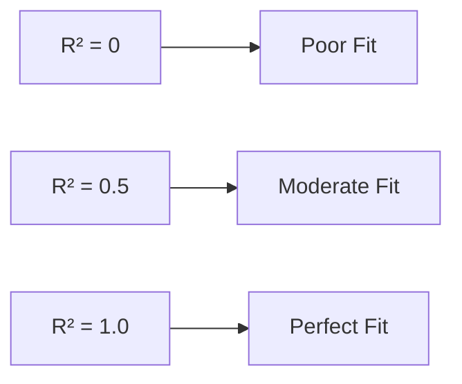
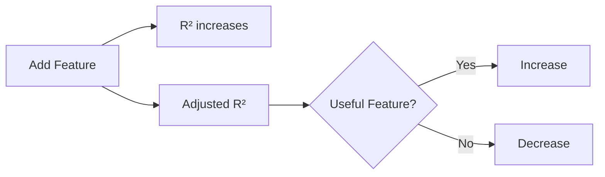

# Machine Learning: Data Preprocessing & Regression Guide

## Part 1: Data Preprocessing

### 1. The Machine Learning Workflow


* **Importing:** Dataset ingestion (e.g., `pandas.read_csv`). Creating the Feature Matrix ($X$) and the Target Vector ($y$).
* **Modeling:** Algorithm selection and training phase (fitting the model to $X_{train}$ and $y_{train}$).
* **Evaluating:** Inference on unseen data ($X_{test}$) and comparing predictions ($\hat{y}$) against actual results ($y_{test}$) using error metrics.

### 2. Train-Test Split Rationale

* **The Problem:** Overfitting. The model memorizes noise instead of learning the underlying signal.
* **The Solution:** Data partitioning.
  * **Train Set (~80%):** Used strictly for coefficient optimization and learning.
  * **Test Set (~20%):** Kept completely isolated. Used *only* for final performance validation.
### 3. Feature Scaling

Many Machine Learning algorithms rely on **Euclidean distance** to measure similarity between observations.

When features have vastly different scales, variables with larger magnitudes dominate the distance calculation.

#### Example Problem

| Age | Salary |
|------|---------|
| 20 | 20,000 |
| 30 | 50,000 |
| 40 | 90,000 |
| 50 | 150,000 |

Even though **Age** may be important, **Salary** contributes much more to distance calculations because its values are significantly larger.



### Why Scale Features?

Feature scaling ensures that all variables contribute equally to the learning process.



---

### Normalization vs Standardization

| Feature | Normalization (Min-Max) | Standardization (Z-score) |
| :--- | :--- | :--- |
| **Formula** | $X_{norm} = \frac{X - X_{min}}{X_{max} - X_{min}}$ | $X_{stand} = \frac{X - \mu}{\sigma}$ |
| **Output Range** | [0, 1] | Typically [-3, 3] |
| **Mean** | Not preserved | Mean = 0 |
| **Standard Deviation** | Not preserved | Standard Deviation = 1 |
| **Best Use Case** | Deep Learning, bounded values | Most ML algorithms |
| **Outlier Sensitivity** | High | Lower |

---

### Normalization Example

```text
Original Values

Age:     20 30 40 50
Salary:  20000 50000 90000 150000
```

↓

```text
After Normalization

Age:     0.00 0.33 0.67 1.00
Salary:  0.00 0.23 0.54 1.00
```



---

### Standardization Example

```text
Original Values

Age:     20 30 40 50
Salary:  20000 50000 90000 150000
```

↓

```text
After Standardization

Age:    -1.2 -0.4 0.4 1.2
Salary: -1.3 -0.3 0.5 1.1
```



---

## Quick Glossary (Key Terminology)
* **Matrix Creation:** In linear algebra, $X$ (Features) is a 2D table (rows = observations, columns = independent variables). $y$ (Target) is a 1D vector (a single column of labels to predict).
* **Inference:** The phase where a fully trained model makes predictions on brand-new, unseen data.
* **Error Metrics:** Mathematical formulas (like MSE or RMSE) calculating the distance between predictions ($\hat{y}$) and actual answers ($y$).
* **Overfitting:** When a complex model learns the dataset "by heart," performing perfectly on training data but failing on unseen data.
* **Euclidean Distance:** The straight-line distance between two points in multidimensional space.
* **Outliers:** Data points differing significantly from other observations.

---

## Part 2: Regression Models

### Section 4: Simple Linear Regression
```text
y
│
│         ●
│      ●
│   ●
│ ●
└──────────────── x
      Regression Line
```

* **Concept:** Predicting a continuous target based on a single feature.
* **Equation:** $y = b_0 + b_1x$
* **Under the Hood:** Uses the Ordinary Least Squares (OLS) method to find the line where the sum of squared residuals is at absolute minimum.
* **Scaling Required?** No. The coefficient automatically compensates for the scale.

### Section 5: Multiple Linear Regression
* **Concept:** Predicting the target using multiple features.
* **Equation:** $y = b_0 + b_1x_1 + b_2x_2 + ... + b_nx_n$
* **The Dummy Variable Trap:** When encoding categorical data, always omit one column to avoid Multicollinearity.
* **Feature Selection:** Use Backward Elimination (evaluating P-values) to remove statistically insignificant variables.

### Section 6: Polynomial Regression
```text
y
│             ●
│         ●
│      ●
│   ●
│ ●
│
└──────────────── x

Curved relationship
```
* **Concept:** Used for non-linear relationships. It fits a curve to the data points.
* **Equation:** $y = b_0 + b_1x_1 + b_2x_1^2 + ... + b_nx_1^n$
* **Why "Linear"?** The unknown parameters we solve for (coefficients $b$) are strictly linear, even though features are raised to a power.

### Section 7: Support Vector Regression (SVR)
```text
        Upper Margin
────────────────────────

      ●      ●

========================
     Regression Line
========================

  ●          ●

────────────────────────
        Lower Margin
```

* **Concept:** Fits the error within a specific threshold (the epsilon-insensitive tube). Data inside the tube is ignored (0 error).
* **Support Vectors:** Points outside the tube dictating its position.
* **Scaling Required?** **Yes (Mandatory).** SVR lacks built-in coefficients to scale down large numbers.

### Section 8: Decision Tree Regression


* **Concept:** Non-continuous model that splits data into segments (leaves) based on logical conditions. Predictions are averages of the terminal leaf.
* **Visual Output:** Looks like a staircase in 1D, not a continuous line.
* **Scaling Required?** No. Relies on logical splits, not Euclidean distances.

### Section 9: Random Forest Regression


* **Concept:** Ensemble Learning. Builds a "forest" of multiple Decision Trees and averages their predictions.
* **Advantage:** Drastically reduces the overfitting typical of single Decision Trees.
* **Scaling Required?** No.

---

## Part 3: Evaluating Model Performance

### 1. R-Squared ($R^2$) - Goodness of Fit


Measures what percentage of the variance in the dependent variable ($y$) is explained by the independent variables ($X$).
* **Equation:** $R^2 = 1 - \frac{SS_{res}}{SS_{tot}}$
  * $SS_{res}$ (Residual Sum of Squares): $\sum(y_i - \hat{y}_i)^2$
  * $SS_{tot}$ (Total Sum of Squares): $\sum(y_i - \bar{y})^2$
* **Interpretation:** Range is 0 to 1. 1 means a perfect fit; 0 means the model simply guesses the average. A negative value means the model is worse than a flat average line.

> **The Fatal Flaw:** Adding *any* new independent variable will cause the standard $R^2$ to either stay the same or increase. It will **never** decrease, even if the new data is completely random. This naturally leads to overfitting.

### 2. Adjusted R-Squared ($Adj R^2$)

Solves the fatal flaw of standard $R^2$ by mathematically penalizing the model for adding useless variables.
* **Equation:** $Adj R^2 = 1 - \frac{(1 - R^2)(n - 1)}{n - p - 1}$
  * $n$ = Number of data points (sample size)
  * $p$ = Number of independent variables (features)
* **Under the Hood:** As you add features ($p$ increases), the denominator $n - p - 1$ gets smaller. This drags the overall Adjusted $R^2$ score down unless the new feature significantly improves the model.

> **MLOps Key Takeaway:** When building Multiple Linear Regression models, **always** use Adjusted $R^2$ to evaluate and compare models. It proves whether a new feature actually adds predictive power or just creates noise.

### Evaluation Project: Combined Cycle Power Plant
**Objective:** Applied the theoretical regression concepts to a real-world dataset to predict the electrical energy output of a power plant.

**Data Architecture:**
* **Features ($X$):** Four continuous environmental variables: Ambient Temperature (AT), Exhaust Vacuum (V), Ambient Pressure (AP), and Relative Humidity (RH) located in the first columns.
* **Target ($y$):** Energy output located in the final column.

**Model Evaluation & Selection Strategy:**
* Processed the dataset through the entire regression arsenal (Multiple Linear, Polynomial, SVR, Decision Tree, Random Forest).
* Strictly utilized **Adjusted $R^2$** as the primary evaluation metric to benchmark the models against each other. This ensured that every environmental feature (e.g., humidity vs. pressure) actively contributed to the predictive power and wasn't artificially inflating a standard $R^2$ score.
* Validated the models on a strict Train/Test split to confirm inference capabilities on unseen environmental states.
* The best was Random Forest Regresion with score 0.9651

# Machine Learning: Classification Models

## Introduction: Classification vs. Regression

* **Regression:** Answers the question *"How much?"*. It predicts a continuous value (e.g., CPU temperature will be 72.5°C).
* **Classification:** Answers the question *"Which category?"*. It predicts a discrete label (e.g., Category `0` = Server OK, Category `1` = Hardware Failure).

---

# Part 4: Classification Models

## Introduction: Classification vs. Regression

* **Regression:** Answers the question *"How much?"*. It predicts a continuous value (e.g., CPU temperature will be 72.5°C).
* **Classification:** Answers the question *"Which category?"*. It predicts a discrete label (e.g., Category `0` = Server OK, Category `1` = Hardware Failure).

---

## Section 1: Logistic Regression

> **🚨 The Naming Trap (Recruitment Pitfall):**
> Despite having the word "Regression" in its name, this is strictly a **classification model**. The name simply stems from the fact that its underlying mathematical engine is linear regression, which is then mathematically modified to assign categories.

### 1. Concept & The Sigmoid Function


* **The Problem with a Straight Line:** If we use standard linear regression ($y = b_0 + b_1x$) to categorize data (where `0` is OK and `1` is Failure), the straight line shoots into infinity. We would get absurd failure predictions like $3500$ or $-42$.
* **The Solution (Sigmoid):** We take the raw output of the linear equation and "squash" it through the logistic function (the Sigmoid curve).
* **The Math:**
  $$p = \frac{1}{1 + e^{-y}}$$
  *(where $y = b_0 + b_1x$)*
* **The Result:** The regression output is brutally squashed into a strict mathematical range **between $0$ and $1$**.

### 2. How it Predicts (The Decision Boundary)

The Logistic Regression model does not directly output a hard decision (e.g., "Failure"). It outputs a **probability ($p$)**.
If a CPU temperature of 85°C enters the model, the output might be $p = 0.88$ (meaning an 88% chance of failure).

We apply a rigid **Decision Boundary** (threshold) to this probability, which defaults to $0.5$:
* If $p \ge 0.5 \rightarrow$ Predict Class `1` (Failure)
* If $p < 0.5 \rightarrow$ Predict Class `0` (OK)

### 3. Engineering Reality (MLOps Focus)

* **Scaling Required? YES.** In the `scikit-learn` library, the `LogisticRegression` class has **L2 Regularization** enabled by default (a mathematical penalty that prevents Overfitting). Regularization logic instantly breaks if the input features are not on the exact same scale. You must always use `StandardScaler`.
* **Interpretability:** This is a highly favored model in enterprise environments because it is extremely easy to explain to management. You know exactly how confident the algorithm is (e.g., "The model is 92% confident that this specific component will fail within 24 hours").
### 🎯 Hands-On Project: Social Network Ads (SUV Purchase Prediction)

**Objective:** Build a binary classification engine to predict whether a customer will purchase a newly released SUV. The business goal is to optimize the marketing budget by targeting social media ads exclusively to users with a mathematically high probability of converting.

**Data Architecture:**
* **Features ($X$):** Two continuous demographic variables: `Age` and `Estimated Salary`. *(Crucial MLOps step: The `User ID` column was explicitly dropped from the feature matrix to prevent the model from assigning weights to random database identifiers).*
* **Target ($y$):** A discrete binary category `Purchased` (`0` = Did not buy, `1` = Bought).

